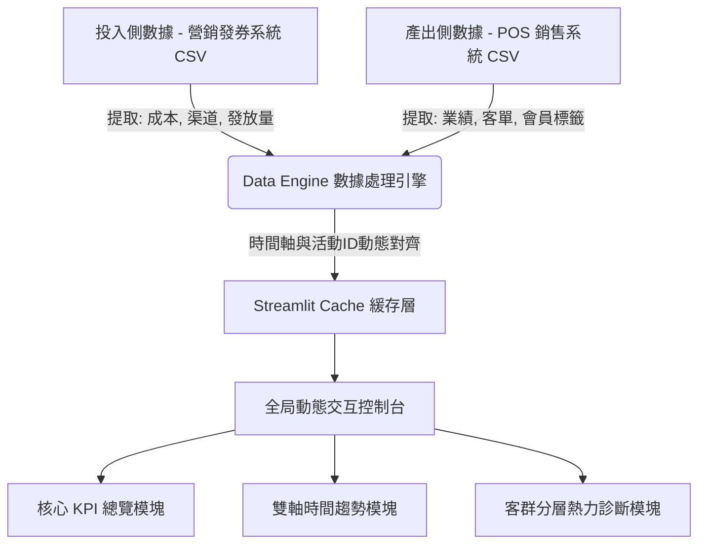

# 北京喬福芳草地 | 數字化營銷投入產出 (ROI) 分析戰情室
# Parkview Green Marketing ROI Analysis Dashboard


---

## 項目簡介

本項目為商業商場實習期間獨立開發的營銷數據全鏈路可視化分析平台，針對商業綜合體線下營銷場景搭建。
系統打通優惠券投放數據與門店實際銷售數據，破除內部數據孤島，實現營銷活動從成本投入到消費成交的全流程數據追溯。
依靠自動數據清洗、多維業務指標計算、營銷滯後性分析與會員分層模型，完成營銷預算梳理、活動投入產出核算、高價值顧客識別等實用功能，為商場營銷策劃、預算調配與會員精細化運營提供數據決策支持。

---

## 系統架構與數據流



---

## 核心業務指標與計算模型

### 1. 營銷投資回報率 / Campaign ROI
用於判定各場營銷活動真實盈利水平，區分高效活動與低效投放活動。
$$ROI = \frac{\sum(\text{核銷訂單總收入}) - \sum(\text{發券總成本})}{\sum(\text{發券總成本})} \times 100\%$$

### 2. 核心客群轉化率 / Conversion Rate
衡量營銷引流精準度，篩選優質投放渠道與活動形式。
$$Conversion Rate = \frac{\text{實際到店核銷人數}}{\text{總計發放優惠券數量}} \times 100\%$$

### 3. 營銷客單提升溢價 / ATV Uplift
量化優惠活動對顧客消費金額的實際拉動效果。
$$ATV_{uplift} = \text{核銷客群平均客單價} - \text{自然流量大盤平均客單價}$$

---

## 項目解決核心業務痛點

* **精準歸因**：解決商場營銷業績難以歸因，無法區分自然客流與活動帶動銷售的行業難題。
* **預算優化**：優化解決營銷預算投放過於集中、資源分配不合理，缺乏數據調整依據的問題。
* **客群精細化**：實現海量會員自動價值分類，解決顧客群體混雜、精細運營難落地的現狀。
* **週期預測**：依靠數據相關性計算判定營銷滯後周期，擺脫傳統運營僅憑經驗判斷的模式。

---

## 功能模塊與效果展示

### 1. 全局交叉分析控制台
系統內置全局聯動篩選器，支持「時間範圍 + 客群世代 + 會員等級」多維度組合篩選，一次篩選，全看板數據同步對齊更新。
* 可按年度 / 季度 / 自定義時間範圍，復盤不同階段的營銷效果。
* 可單獨聚焦特定客群世代（如 90 後 / 00 後）、會員等級，精細化分析不同群體的營銷敏感度與消費特徵。
* 默認不篩選時，自動加載全量大盤數據，兼顧整體分析與個體聚焦的需求。

#### 篩選面板狀態對比
| 篩選器未展開狀態 | 篩選面板展開狀態 |
| :---: | :---: |
|  |  |

#### 數據聯動效果對比
| 全局篩選前（全場大盤視圖） | 篩選指定活動後（單戰役聚焦視圖） |
| :---: | :---: |
|  |  |

### 2. 雙端核心 KPI 總覽
整合營銷投入數據與商場整體經營業績，一頁直觀掌握整體營銷運營狀況。


### 3. 投入與業績結構拆解
一側展示各類優惠券投放佔比，另一側對比商場不同業態營收貢獻，輔助調整營銷資源配比。


### 4. 營銷節奏與業績滯後趨勢分析
在統一時間軸內對比發券節奏與銷售走勢，自動分析活動短期引流效果與長期滯後帶動效益。


### 5. 會員客群分層價值診斷
搭設商場專屬客群劃分規則，自動完成會員價值標註，實現數據驅動的客群健康度判定：
* `🔴 營銷耗損型客群 (風險紅標識)`：領券意願高、實際消費偏低，適度收緊營銷投放。
* `🟡 自然高價值客群 (品質金標識)`：消費實力強，依賴自主到店消費。
* `🟢 高價值轉化客群 (增長綠標識)`：對營銷活動敏感度高，為商場核心盈利群體。
* `⚪ 常規基礎客群 (基礎白標識)`：維持商場日常基礎客流與穩定營收。


---

## 使用指南

### 數據格式要求
* **投入側數據**：活動名稱、投放渠道、發券數量、單張優惠券營銷成本。
* **產出側數據**：消費日期、訂單核銷金額、會員屬性、顧客實際客單價。
> 提示：數據統一整理為標準 CSV 文件即可上傳使用。

### 操作流程


1. 運行項目後，在頁面左側邊欄分別上傳兩組業務數據表。
2. 系統自動完成數據清洗、關聯匹配與指標運算。
3. 通過側邊欄篩選條件自由切換分析場景，自定義分析維度。

---

## 快速啟動

```bash
# 安裝項目依賴庫
pip install -r requirements.txt

# 啟動可視化分析平台
streamlit run app.py
```

---

## 開發備註
* 出於商場商業數據保密需求，真實線下營運數據已做脫敏與隔離處理，未隨項目一同提交。
* 本項目採用輕量級 Python 技術棧開發，部署簡單、操作門檻低，適合商場內非技術崗位運營人員日常查看使用。